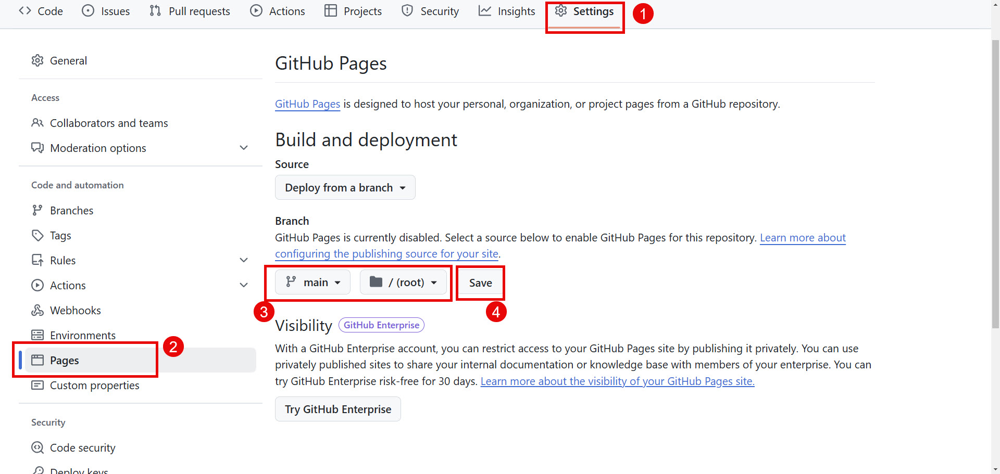

# Tutorial_GitHub_Actions

## Aufbau der Pipeline
Siehe unter dem Tab Actions

## Puplikation auf Pages
https://guthoch2.github.io/Tutorial_GitHub_Actions/

## Konfiguration
Damit das Deployment auf Pages funktioniert... 
- muss das Repo public sein (ausser bei Pro Lizenz)
- muss der Branch in den Settings ausgewählt werden. Siehe Bild unten:

